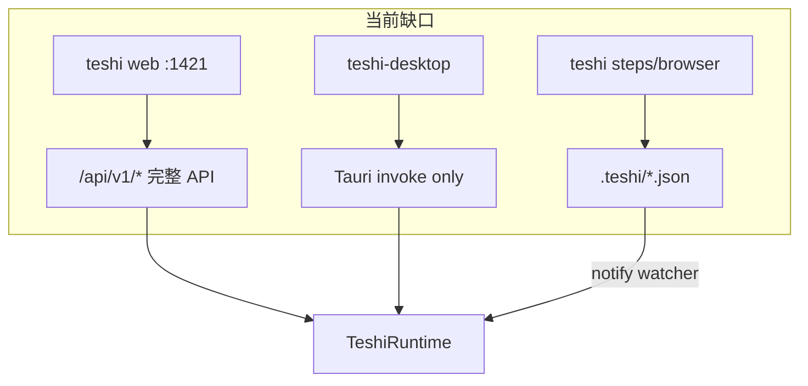
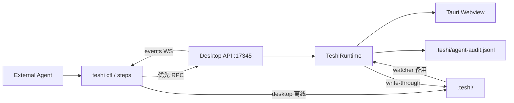

# 混合控制面：文件持久化 + RPC 实时控制

## 目标

外部 Agent 在 **teshi-desktop 已打开** 时，可通过 `teshi` CLI **实时**驱动与 UI 同步的操作（开项目、选步、启停 browser sidecar、locator confirm/reject、终端写入等），而不依赖文件 watcher 的延迟或 sidecar 与 Desktop 状态脱节。

用户已选定架构 **C**：

| 层 | 职责 |
|---|---|
| **RPC** (`127.0.0.1`) | 实时控制、事件订阅、与 `TeshiRuntime` + Tauri `emit` 同步 |
| **`.teshi/` 文件** | 持久化（`active-step.json`、`pending-locator.json`、`step-bindings/`、`cdp-endpoint.json`）+ 审计 JSONL |
| **文件-only 回退** | Desktop 未运行时，现有 `teshi steps *` 等仍可直接写文件（CI/脚本） |

## 现状（可复用）



- [`crates/teshi-web/src/server.rs`](crates/teshi-web/src/server.rs) 已实现完整 Axum 路由（projects、locator、browser、terminal、events WS），与 [`desktop/src/platform/types.ts`](desktop/src/platform/types.ts) 的 `TeshiRuntimeApi` 对齐。
- [`desktop/src-tauri/src/lib.rs`](desktop/src-tauri/src/lib.rs) 在 `setup` 中创建 `Arc<TeshiRuntime>` 并 `app.manage(rt)`，但 **未启动 loopback API**。
- CLI [`src/cli/steps.rs`](src/cli/steps.rs) 多数操作 **只写文件**（如 `write_active_step`、`propose_locator`）；Desktop 通过 [`crates/teshi-runtime/src/locator.rs`](crates/teshi-runtime/src/locator.rs) 的 watcher 异步刷新 UI——对 Agent 而言延迟且无法触发 runtime 侧动作（如 sidecar highlight、PTY）。

## 目标架构



## 实现方案

### Phase 1 — 抽取共享 API 层

**不要复制路由。** 重构 [`crates/teshi-web/src/server.rs`](crates/teshi-web/src/server.rs)：

- 导出 `pub fn api_router(rt: Arc<TeshiRuntime>) -> Router`（仅 `/api/v1/*`，无 `ServeDir` fallback）。
- `run_server(addr, rt, dist)` 变为 `api_router(rt).merge(static_fallback(dist))`。
- 新增 `pub async fn serve_api(addr, rt) -> Result<()>`（API-only，供 desktop 使用）。

可选：若 desktop 不宜依赖整个 `teshi-web` crate，则新建 `crates/teshi-api` 并把 `server.rs` 移入；**推荐先在同一 crate 内拆分**以减小 diff。

### Phase 2 — Desktop 内嵌控制服务

修改 [`desktop/src-tauri/src/lib.rs`](desktop/src-tauri/src/lib.rs) + 新模块 `desktop/src-tauri/src/control_server.rs`：

1. 在 `setup` 取得 `Arc<TeshiRuntime>` 后，`tauri::async_runtime::spawn` 启动 API server。
2. **默认绑定** `127.0.0.1:17345`（与 `teshi web` 默认 `1421` 错开，避免 dogfood 时端口冲突）。
3. 启动时生成随机 token（`uuid` 或 32-byte hex），写入控制面 manifest：
   - 全局：`<app_data_dir>/desktop-control.json`（复用 [`crates/teshi-runtime/src/app_data.rs`](crates/teshi-runtime/src/app_data.rs)）
   - 项目打开后镜像：`<project>/.teshi/control-endpoint.json`（含 `base_url`、`token`、`pid`、`project_root`）
4. Desktop 退出时删除/失效 manifest。
5. **安全默认**：仅 loopback；所有 mutating 请求要求 `Authorization: Bearer <token>`（Axum middleware）；CORS 限制为 `127.0.0.1` origins（比 `teshi web` 的 `Any` 更严）。
6. 将现有 `HostEventCallback`（Tauri `emit`）保持不变——RPC 与 invoke 共用同一 `TeshiRuntime`，UI 事件路径一致。

**依赖**：`desktop/src-tauri/Cargo.toml` 增加 `teshi-web`（或 `teshi-api`）、`axum`、`tower-http`（cors）、`uuid`。

**CLI 开关**（[`desktop/src-tauri/src/cli.rs`](desktop/src-tauri/src/cli.rs)）：

- `--control-port <PORT>`（默认 17345）
- `--no-control-server`（调试/测试禁用）

### Phase 3 — CLI 控制客户端 `teshi ctl`

新增 [`src/cli/ctl.rs`](src/cli/ctl.rs)，在 [`src/cli/mod.rs`](src/cli/mod.rs) 注册 `Command::Ctl`。

**端点发现顺序**（封装为 `resolve_control_endpoint(project_root?)`）：

1. `TESHI_CTL_URL`（含 token 或配合 `TESHI_CTL_TOKEN`）
2. `<cwd>/.teshi/control-endpoint.json`（向上遍历祖先，类似 `cdp-endpoint.json` 解析）
3. `<app_data_dir>/desktop-control.json`
4. 探测默认 `http://127.0.0.1:17345` + 读全局 manifest token

**v1 子命令**（映射现有 `/api/v1`，JSON stdout 供 Agent 解析）：

| CLI | HTTP | 实时 UI 价值 |
|-----|------|-------------|
| `ctl status` | `GET switch-allowed` + manifest | 判断 desktop 是否在线 |
| `ctl events [--follow]` | `WS /api/v1/events` | 订阅 `active-step-changed` 等 |
| `ctl project open PATH` | `POST /projects/open` | 打开项目 + 刷新 Welcome/FileTree |
| `ctl project teardown` | `POST /projects/teardown` | 释放 sidecar/terminal |
| `ctl browser start [--mode]` | `POST /browser/start` | Connect Embedded/Chrome/WinApp |
| `ctl browser stop` | `POST /browser/stop` | |
| `ctl locator sync-step -f -l` | `POST /locator/sync-step` | 即时高亮 Gherkin 行 |
| `ctl locator confirm/reject/highlight` | 对应 POST | 与 Locator 面板同步 |
| `ctl terminal spawn/write/resize/stop` | 对应 POST | 驱动 Embedded 终端面板 |
| `ctl gherkin render PATH` | `POST /gherkin/render` | 刷新 Gherkin 面板内容 |
| `ctl fs list PATH` | `GET /fs/list` | 文件树状态 |

实现用 `reqwest`（blocking 或 async，与现有 CLI 风格一致）+ `tokio-tungstenite` 或 `reqwest` WS 用于 events。

**错误语义**：连接失败 → 明确提示 “desktop control server not running”；HTTP 4xx → 打印 API `{ "error": "..." }` 并以非零退出码结束。

### Phase 4 — 现有命令的智能路由（混合核心）

在 [`src/cli/steps.rs`](src/cli/steps.rs) 等引入薄封装 `with_desktop_rpc(project_root, |client| ...)`：

| 操作 | Desktop 在线 | Desktop 离线 |
|------|-------------|-------------|
| `steps select` / `next-unbound` | RPC `sync-step`（写文件 + 即时 emit） | `write_active_step`（现有） |
| `steps propose` | 仍写 `pending-locator.json`（审计）+ 可选 RPC 触发 highlight | 文件-only |
| `steps confirm` / `reject` | RPC `locator/confirm|reject` | `confirm_pending_locator_file`（现有） |
| `browser start`（未来可加） | RPC `browser/start` | 保持 `serve-embedded` sidecar 路径 |

全局行为开关：

- 默认 **`auto`**：发现 control endpoint 则走 RPC，否则 file-only。
- `--file-only`：强制旧路径（CI/无 desktop）。
- `TESHI_CTL_MODE=rpc|file|auto` 环境变量覆盖。

这样 Agent 无需记忆两套命令，现有 skill（`bdd-replay`、`winapp-locator`）继续有效，但在 desktop 打开时自动变快、更一致。

### Phase 5 — 审计日志（文件层）

新增 runtime 或 API middleware：每次 mutating RPC 追加一行 JSONL 到 `.teshi/agent-audit.jsonl`：

```json
{"ts":"...","source":"ctl","method":"POST","path":"/api/v1/locator/sync-step","body":{...},"ok":true}
```

- CLI file-only 路径在 `write_active_step` / `propose_locator` 等关键点同样追加（`source: "cli-file"`）。
- 与现有 opt-in `TESHI_BROWSER_DEBUG` → `.teshi/logs/cli-browser.log` 并存；审计默认可关（`TESHI_AUDIT=0`）或默认开启仅 append（体量小）。

### Phase 6 — 文档与 Agent Skill

- 新文档 [`doc/desktop-control-plane.md`](doc/desktop-control-plane.md)：架构 C、端口、token、manifest 路径、`teshi ctl` 示例、与 `teshi web` 区别。
- 更新 [`doc/cli-usage.md`](doc/cli-usage.md)、[`README.md`](README.md) 简短提及 `teshi ctl`。
- 新 skill [`.teshi/skills/desktop-agent-control/SKILL.md`](.teshi/skills/desktop-agent-control/SKILL.md)：Agent 工作流（`ctl status` → `project open` → `browser start` → `steps select` → `browser replay`）。
- 可选：在 [`doc/web-ui-self-test.md`](doc/web-ui-self-test.md) 加一节 “用 ctl 驱动已安装的 desktop 做自举”。

## 明确不在 v1 范围

- **原生文件对话框**（`open_project_dir`）——保留人工；Agent 用 `ctl project open <path>`。
- **纯前端布局状态**（面板折叠、窗口尺寸）——无 runtime 契约，后续单独设计。
- **Browser 地址栏 navigate**——v1 继续用 `teshi browser navigate` + sidecar；不在 ctl 重复造轮子。
- **跨机器远程控制**——仅 loopback；远程需另做隧道/鉴权。

## 验证计划

1. **单元**：`resolve_control_endpoint` 解析 manifest / 祖先目录。
2. **集成（本地）**：
   - 启动 `teshi desktop --project .`
   - `teshi ctl status` → 200
   - `teshi ctl browser start --mode embedded` → Desktop Browser 面板状态变化 + `.teshi/cdp-endpoint.json` 出现
   - `teshi steps select ...`（auto）→ Gherkin 高亮无需等待 watcher
   - 关闭 desktop → `teshi steps select` 仍 file-only 成功
3. **回归**：`scripts/run-web-ui-smoke.sh` 不受影响（无 desktop RPC）。
4. **质量门**：`cargo fmt --all`、`cargo clippy -D warnings`、`cargo test --all`。

## 关键文件一览

| 文件 | 变更 |
|------|------|
| [`crates/teshi-web/src/server.rs`](crates/teshi-web/src/server.rs) | 抽取 `api_router` / `serve_api` |
| [`desktop/src-tauri/src/lib.rs`](desktop/src-tauri/src/lib.rs) | spawn control server |
| [`desktop/src-tauri/src/control_server.rs`](desktop/src-tauri/src/control_server.rs) | 新建：manifest、token、生命周期 |
| [`src/cli/ctl.rs`](src/cli/ctl.rs) | 新建：HTTP/WS 客户端与子命令 |
| [`src/cli/steps.rs`](src/cli/steps.rs) | auto RPC 路由 |
| [`crates/teshi-runtime/src/`](crates/teshi-runtime/src/) | 可选：`append_agent_audit` 辅助函数 |
| [`doc/desktop-control-plane.md`](doc/desktop-control-plane.md) | 新建文档 |

## 默认决策（未单独 grill 的项）

- **控制端口**：`17345`（desktop）vs `1421`（web AUT）
- **鉴权**：loopback + manifest bearer token
- **v1 API 范围**：完整镜像现有 `/api/v1/*`，CLI 先覆盖 Agent 高频操作
- **回退**：`auto` 检测 desktop；`--file-only` 显式降级
