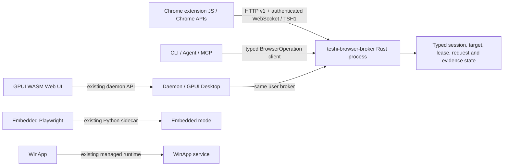

## Context

The latest `origin/dev` is `6728bfef746679d2f1d825152d0ffb8e0f9e19a2` (2026-09-24). Chrome startup currently flows from `start_browser_sidecar_with_options(Chrome)` through `ensure_user_chrome_broker`, which resolves the current project's `.venv`, checks `websockets`, and detaches `resources/browser_service.py --mode chrome`. That process serves HTTP discovery on `127.0.0.1:17373`, a dynamically selected authenticated WebSocket, and `ChromeBridge` backed by `BrowserSessionBroker`.

The Python broker owns considerably more than transport: Profile/window/tab registration, liveness and compatibility, target resolution, exclusive leases, direct and heartbeat-fallback command queues, request correlation/cancellation, page revisions and element references, locator ranking and verification coordination, screenshot/PDF artifact handling, Console and acknowledged Network capture, capability grants, project policy, audit records, and diagnostics. `extension/teshi-bridge/background.js` owns Chrome APIs, CDP attachment, DOM/accessibility inspection, actual browser input/navigation, screencast production, and client-side capture buffering. Embedded Playwright shares `browser_service.py` but uses `EmbeddedSession` and remains Python-backed; WinApp uses `resources/winapp_service.py` and its managed Python runtime.

Rust already supplies typed `BrowserOperation`/response models and a WebSocket client in `teshi-engine::browser_agent`, per-user startup coordination and version checks in `sidecar.rs`, project endpoint parsing/writing in `teshi-tui::cli::browser_endpoint`, CLI operations in `browser.rs`, STDIO MCP adapters in `mcp.rs`, and a shared `BrowserSessionsBackend` used by Desktop and the daemon-backed WASM Web UI. These are reusable entry points, not a broker server.

Two migration hazards are visible in the current implementation. First, the shared process still treats the first starter's project as extension ownership: heartbeats and `stream_hello` must match `ChromeBridge.project_root`, discovery publishes that path, and that process writes only that project's endpoint. Command policy/artifact helpers have a newer request-scoped project resolver, so project switching is only partially fixed. Second, unauthenticated `GET /v1/bridge` returns the bearer token inside `ws_url` and the startup project path; HTTP CORS and WebSocket Origin checks accept any syntactically valid `chrome-extension://` origin. Mutations and WebSockets still check the random token and listeners normally bind loopback, but discovery and origin scope need explicit negative security tests before the Rust port.

The current JSON contract fixture is read by Python and extension Node tests, but not Rust. Existing browser unit and real two-Profile tests are present under `resources/tests`; `ci.yml` does not run the browser suites. Release and MSI staging currently copy both Python browser modules, while the Embedded and WinApp runtimes also legitimately retain Python resources.

## Goals / Non-Goals

**Goals:**

- Provide one Rust-owned, per-OS-user Chrome broker process that all Teshi surfaces can reuse without Python, `pip`, `uv`, a project venv, or Playwright.
- Preserve HTTP discovery port 17373, dynamic WebSocket selection, TSH1 binary frames, protocol v1 request/response shapes, legacy single-session resolution rules, endpoint file readers, and existing step bindings.
- Keep browser execution primitives in the extension. Rust owns typed policy, authorization, orchestration, routing, persistence, and resource bounds.
- Make extension sessions profile-scoped and project-neutral. Every agent operation supplies canonical project context; leases and grants retain project/caller/profile scope. Closing one project or client must not stop the broker or invalidate another owner's lease.
- Establish deterministic contract, transition, side-effect, negative security, two-Profile, recovery, no-Python, packaging, and performance evidence before removing the production Python Chrome path.
- Reuse current Workspace versions of Tokio, Serde, UUID, Axum 0.8, and Tungstenite 0.24 rather than adding a second HTTP/WebSocket stack.

**Non-Goals:**

- Rewriting Chrome extension APIs/CDP work in Rust or removing JavaScript from the extension.
- Replacing Python Playwright for Embedded mode or changing the WinApp managed runtime.
- Remote browser control, wider-than-loopback binding, automatic privileged grants, or silent retry after an automation failure.
- Removing Python source used by unrelated developer tools, Embedded, WinApp, or migration comparison before its consumers are proven independent.

## Decisions

### Runtime and module boundaries

Add `crates/teshi-browser-broker` as a Workspace library that owns typed protocol records, session/lease/request state, authorization, capture stores, and HTTP/WebSocket handlers. It must not depend on `teshi-engine` or UI crates. The existing `teshi` CLI gets a hidden internal broker-serve command that calls this library; `teshi-engine` launches the CLI executable as a detached child (the current CLI itself, or its packaged sibling when invoked from Desktop/Daemon). This avoids a user-managed service or a separately installed runtime component. The launcher continues to use a user-local state directory and inter-process startup lock, checks protocol/features before reuse, records PID plus broker-start ID, and never kills an unknown listener.

The first crate modules should follow real ownership boundaries: `protocol` for strict versioned serde DTOs and fixture tests; `session` for registry and target resolver; `lease`; `request` for pending/cancellation and queue transitions; `locator` for pure candidate normalization/ranking plus extension verification coordination; `evidence` for screenshots/preview/Console/Network bounded stores; `authorization` for capability checks and audit; and `server` for loopback HTTP and authenticated WebSocket adaptation. Split modules only when the implementation requires it.

### One process, explicit project context

Broker process identity and extension session lifetime are OS-user scoped, never project scoped. The extension heartbeat registers profile/browser/window/tab metadata and does not authorize a project. Its legacy `project_root` field may be accepted as ignored compatibility metadata; it cannot bind a Profile to the first project that started Teshi. Agent command envelopes carry a canonical project root and caller label. Leases remain exclusive at the extension-instance level and store their owning project/caller as well as broker generation; every leased operation validates all of those fields and the complete extension-instance/window/tab target. P2 grants additionally remain bound to current OS user, broker start ID, project, caller, Profile, capability, and expiry. A project shutdown never performs global broker teardown or releases unrelated grants/leases. Explicit release or lease expiry handles stale ownership.

Each project keeps its own `.teshi/cdp-endpoint.json` compatibility pointer to the shared broker, with PID/start ID and protocol/features for staleness checks. The per-user broker record owns its credential and lifecycle data. Public discovery and logs omit project filesystem paths, lease tokens, capability tokens, cookies, page bodies, and capture bodies. Endpoint readers continue to accept existing endpoint records during upgrade.

### Wire compatibility and local security

Keep schema/protocol v1 fields and command names for discovery, heartbeat, direct command/response, TSH1 frames, network batches/acks, diagnostics, and legacy implicit target resolution. Preserve fixed port 17373 and dynamic authenticated WebSocket port. Negotiate features without pretending unsupported features exist; unknown privileged operations and fields fail closed. Rust serialization tests consume the shared JSON fixtures, and Python/Node harnesses consume the same fixtures while the old implementation remains the oracle.

The listener binds only `127.0.0.1` by default, rejects unexpected Host/Origin values, checks the broker token in constant time for mutations and WebSockets, and applies distinct HTTP JSON, text frame, and binary frame limits plus connection, queue, and timeout bounds. Discovery may expose only the metadata needed for compatibility. The current bearer-in-discovery behavior must not be copied without a tested origin-bound handoff: credential delivery is limited to a per-user allowlist of at most 16 exact `chrome-extension://<32-character-id>` origins, and ordinary web-page origins are denied. Only an explicit pairing action may change this allowlist; an extension never self-authorizes merely by requesting discovery. Native CLI authentication remains in the per-user private state record. Every allowed Origin receives the same generation-bound broker secret, so removing an ID must take effect on the next broker generation and must never remove a different user's or project's grants.

Before a native client reuses a listener, it must prove possession of the private token without sending that token to the listener. A one-shot 256-bit client nonce is answered with an HMAC-SHA256 over a domain-separated message containing the nonce and exact schema, protocol, PID, and broker start ID; the client verifies it in constant time against its private credential. The proof endpoint is loopback/Host/Origin constrained, size bounded, and does not alter the Chrome extension v1 contract. A listener that copies public discovery metadata or blindly accepts a WebSocket upgrade cannot impersonate a compatible broker.

Do not add a new `manifest.key` as the migration mechanism. The supported extension is loaded unpacked from the MSI path, browser-testing package, or repository checkout; the current manifest has no stable key, so those paths can produce different Chrome extension IDs. The extension also stores its opaque Profile instance ID in `chrome.storage.local`, which is scoped to the extension identity. Forcing a new ID risks making existing Profile identity data appear lost. Preserve the existing ID and storage in place; explicitly pair the ID shown by the extension popup before Rust returns credentials. If the user moves the unpacked folder and Chrome assigns a new ID, add/pair the new ID first, verify the Profile reconnects and its stored instance ID is intact, and only then remove the old installation/allowlist entry. A moved installation requires re-pairing; there is no wildcard or automatic migration grant. The user-level pairing UI and durable allowlist editor are prerequisites for production cutover.

For legacy endpoint consumers, keep existing `ws_url` and broker identity fields readable. A new Rust marker can be added without making old readers reject the endpoint. The broker implementation marker changes from `python` only after consumers have been located and tests demonstrate they do not dispatch from that string. Protocol changes beyond the existing version require a new advertised protocol version and an explicit extension/CLI upgrade path.

### State transitions and failure behavior

Use typed enums/records for session health, lease ownership, target, pending request state, locator revision, capture state, and stable error codes; arbitrary JSON values are accepted only at protocol edges and bounded before storage. A short state lock protects transitions and is released before socket sends, filesystem operations, or awaits. Each request ID transitions once from queued/sent to completed, failed, cancelled, or expired. Disconnect cancels requests owned by that extension and removes only its stream handle. Reconnect replaces that handle by generation so stale responses cannot complete new work. Late or mismatched responses are quarantined and never routed to another Profile. Lease expiry is checked immediately before dispatch; there is no action retry after timeout or ambiguous completion.

Snapshot references are per Profile and target, expire, and include page revision. The extension re-verifies selected candidates in the live frame/shadow context. A zero/multiple match, hidden/disabled element, changed document, timed-out wait, failed assertion, or missing evidence remains a stable failure with request/target/revision context; absence of a thrown extension error is not a passing assertion.

### Evidence and storage

Preserve TSH1 frame metadata and target identity, but route previews only to subscribers of that complete target. Keep frames binary and bounded; avoid JSON/base64 copies on the WebSocket path. Console and Network stores remain bounded by age, event count, and bytes and redact sensitive metadata before diagnostics. Network capture keys are target plus capture ID; accepted sequence numbers are monotonic and contiguous, duplicate batches are acknowledged without recounting, gaps are reported, and retries resend only unacknowledged extension events. Body detail access is explicitly authorized; listing never returns bodies. Project artifacts use canonicalized roots and generated broker-owned relative names, reject traversal/symlink escapes, and write atomically only after payload bounds are checked.

### Existing entry points and migration map

| Current files / owners | Rust destination or treatment | Contract tests |
| --- | --- | --- |
| `resources/browser_service.py` Chrome `ChromeBridge`, HTTP parser, `run_http_discovery`, `run_chrome`; `resources/browser_agent_broker.py` | `teshi-browser-broker::{server,protocol,session,lease,request,locator,evidence,authorization}`. Keep only Embedded path in `browser_service.py`; split imports so Embedded does not load Chrome broker code. | Shared fixture harness; HTTP/WebSocket integration; Python differential run during migration |
| `extension/teshi-bridge/background.js`, `manifest.json`, `tests/*` | Keep JS/CDP implementation. Change only identity/origin handshake, protocol compatibility metadata, and any verified wire mismatch. | Node protocol/network suite; real Chrome two-Profile E2E |
| `crates/teshi-engine/src/sidecar.rs`, `venv.rs`, `browser_agent.rs`, `lib.rs` | Reuse typed operations and lifecycle abstractions; launch the hidden CLI broker command for Chrome and do not call `resolve_project_venv` or import-check Python on this branch. Keep venv use for Embedded. | engine endpoint/process tests; mode-selection no-Python test |
| `crates/teshi-tui/src/cli/browser.rs`, `browser_endpoint.rs`, `mcp.rs`; Agent browser executors | Continue through `BrowserOperation`; persist/refresh each caller project's endpoint and scope requests/grants. | CLI/MCP operation parity and endpoint compatibility tests |
| `apps/teshi-daemon`, `apps/teshi-desktop`, `crates/teshi-ui`, `apps/teshi-web`, `teshi-web-protocol` | Keep daemon API as Desktop/Web UI adapter. All start/list/preview requests resolve to the same user broker; Web UI protocol does not own duplicate browser state. | daemon route integration; UI adapter contract; wasm smoke |
| `resources/browser_contract_fixtures.json`, Python browser tests, extension tests, existing P0 two-Profile E2E | Extend fixtures with full state-transition and malformed/security cases; add Rust consumer and differential harness; add browser tests to CI where executable. | Baseline and post-port reports with exact command output |
| `.github/workflows/ci.yml`, `release.yml`, `nightly.yml`, `scripts/build-msi.ps1`, package contract scripts, docs and Skills | Bundle/build the internal broker via the Teshi binary, remove Chrome-only Python/vnev setup after all gates, retain Embedded/WinApp resources and runtime. | Staging artifact inspection; install test with Python absent; release/nightly contract tests |

## Risks / Trade-offs

- [Unpacked extension identity varies by install path] → Do not change the manifest key or silently trust every extension. Preserve each current ID and Chrome storage, require explicit user pairing, allow multiple exact per-user IDs, and document add-new-before-remove-old when an unpacked path changes.
- [Shared broker currently has a first-project heartbeat/stream binding] → Remove that authority and test two independent project roots against the same live Profiles; keep request-scoped policy/artifact roots and project-bound grants/leases.
- [A large Python class combines Embedded and Chrome concerns] → Move behavior in slices and retain the Embedded runtime tests; do not delete or import-gate code until direct consumers are inventoried.
- [Feature drift and contract overclaim] → Run Python behavior baselines, make Rust consume the same fixtures, compare normalized responses, and require observable browser side effects in E2E tests.
- [Async transport introduces races/resource exhaustion] → Bound connections/messages/queues, test cancel/response/disconnect races, and never hold state locks across await or filesystem/network I/O.
- [Release output may omit the internal CLI broker entry point] → Add staging assertions on Windows MSI/EXE, Linux/macOS archives, and nightly bundles before changing runtime selection.
- [Rust may use more memory for retained capture/evidence data despite safer bounds] → Benchmark against the current Python broker and enforce explicit budgets; make no speed claim without results.

## Migration Plan

1. Record the latest-dev Python/extension behavior and security baseline; expand fixtures and CI execution without changing runtime selection.
2. Add typed Rust protocol models and loopback HTTP/WebSocket transport; keep the Python service as the production implementation and run differential conformance tests.
3. Port sessions, target routing, leases, pending requests, cancellation, and element references; verify Profile isolation and project-scoped ownership.
4. Port locator strategy and command/wait/assert coordination; require extension-side verification and explicit failure evidence.
5. Port screenshot/preview, Console, Network capture, artifact bounds, acks, deduplication, and reconnect; validate real Chrome and backpressure.
6. Port capability grants, policy, file safety, auth/origin checks, audit, and negative security tests; do not relax legacy permission checks.
7. Route CLI, Daemon, Agent/MCP, Desktop, and Web UI through one Rust process. Exercise concurrent startup, process exit/crash/restart, and Python-free Chrome mode while Embedded and WinApp continue on Python.
8. Update all packaging, CI, release/nightly gates, docs, extension upgrade guidance, and performance reports. Make Rust the only production Chrome broker only after all acceptance gates pass; remove Chrome-only Python code last.

Rollback before stage 8 is a runtime-selection rollback to the Python implementation while keeping the extension's v1 messages and shared fixtures. After Rust-only release, rollback requires a Teshi release that restores the old broker package and the matching extension/endpoint compatibility path; never silently fall back at runtime, because that would hide Rust broker failures.

## Open Questions

- Which extension distribution IDs beyond the documented MSI, browser-testing package, and repository checkout are supported, and where should the explicit per-user pairing UI live (extension popup, Desktop settings, CLI, or a shared flow)? This must be answered before production cutover; the transport itself accepts only configured exact IDs.
- Does every supported packaged channel include `teshi` beside Desktop/Daemon so those applications can launch its hidden broker command, or must the CLI expose a small library-callable process mode for development installs?
- Which real-Chrome E2E environment is available for headful multi-Profile, permission-prompt, screenshot, and Network acceptance in CI? The existing two-Profile test is manual/environment-dependent and does not establish all eight final gates.
